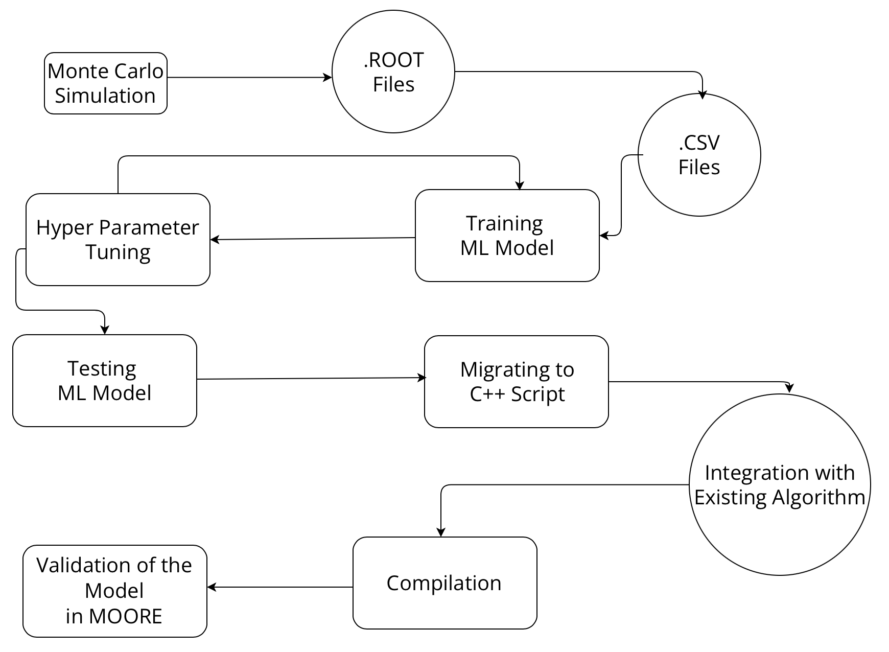

# Building Second Generation Machine Learning based Algorithm for Long-lived Particles Reconstruction in Upgraded LHCb Experiment, CERN.

## Detailed Description:
At LHCb, one of the major detectors in Large Hadron Collider(LHC) study about the cause of Matter and Anti-Matter asymmetry.  

On 2022, the going to restart after major upgrades. The opposite moving particles collide each other within four detectors at every 25ns cycle corresponds to 40MHz.  

The amount of data generated at every event is so huge in volume, to filter out data generated to the storage tapes, it require an advanced and more sophisticated Trigger System is required.  

The existing Hardware Trigger System(L0) is completely replaced by Software Trigger Systems on Run 3/Upgrade 1 on 2022.  

I work in building a Machine Learning based track classifier and deploy it in the Track Reconstruction Algorithm Sequence.

---

## Challenges : 
* Working on Monte Carlo Simulation Data
* Train the models on Huge Volume of Data
* Computational Limitations
* Imbalance Data Modeling
* Multi-language scripting (Eg: Python,C++)

---

## Work Pipeline (Simplified)

1. Input Data
2. Split the data(70% Training & 30% Testing)
3. Train the Machine Learning Model
4. Fine Tune the Model Parameters
5. Test Model Performance
6. Translate the code to C++
7. Deploy the model to Track Reconstruction Algorithm
8. Validate Model Performance
9. Analysis on the data generated after filteration.

---
### Project Workflow

--- 

### Suggestions:

* Best ways to optimize time in C++
* Best practice to balance imbalance data models, when you have huge volume of data samples.
* Run python scripts with limited CPU Cores in Server.
* Any suggestions to optimize the workflow above.

---
